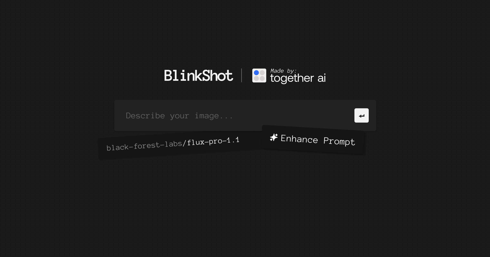

<a href="https://www.blinkshot.io">
  
  <h1 align="center">BlinkShot</h1>
</a>

  An open source real-time AI image generator. Powered by Juggernaut Lightning Flux through Together.ai.

## Tech stack

- [Juggernaut Lightning Flux](https://www.together.ai/models/juggernaut-lightning-flux) from RunDiffusion for the image model
- [Together AI](https://togetherai.link/?utm_source=blinkshot&utm_medium=referral&utm_campaign=example-app) for inference
- Next.js app router with Tailwind
- [Braintrust](https://www.braintrust.dev/) for image-generation tracing and observability
- Plausible for website analytics

## Cloning & running

1. Clone the repo: `git clone https://github.com/Nutlope/blinkshot`
2. Create a `.env.local` file and add your [Together AI API key](https://togetherai.link/?utm_source=blinkshot&utm_medium=referral&utm_campaign=example-app): `TOGETHER_API_KEY=`
3. Run `npm install` and `npm run dev` to install dependencies and run locally

## Future Tasks

- [ ] Show a download button so people can get their images
- [ ] Add auth and rate limit by email instead of IP
- [ ] Show people how many credits they have left
- [ ] Build an image gallery of cool generations w/ their prompts
- [ ] Add replay functionality so people can replay consistent generations
- [ ] Add a setting to select between steps (2-5)
